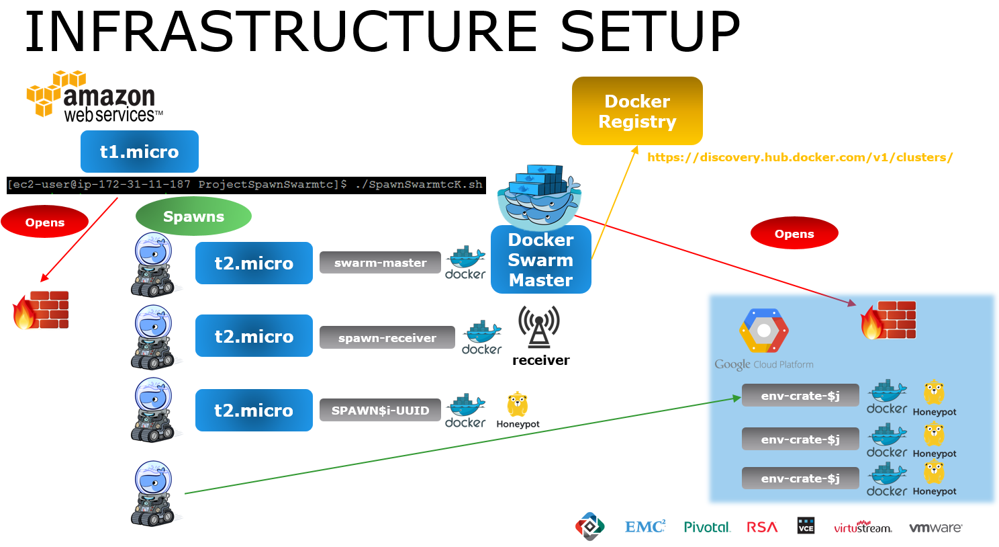
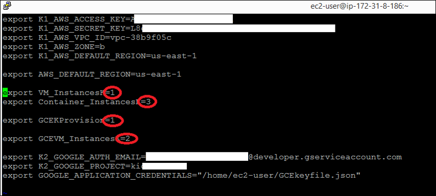
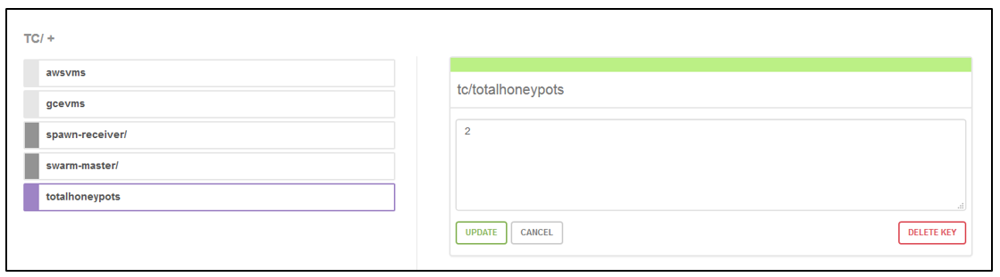
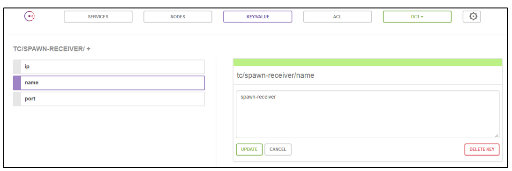

# ProjectSpawnSwarmtc
Project to Spawn a titanium crucible (receiver + multiple honeypots) installation in an automated way accross different Clouds (AWS and optionally GCE) using Docker Machine, Docker Swarm and Docker Discovery. 
A dockerized Consul instance is used to store variables in a KV store.

Tested on a t1.micro AMI

To install the prerequisites on an AMI image use this piece of code:

https://github.com/FabioChiodini/AWSDockermachine

[the script is run in the context of ec2-user account]

## Configuration Files
To run this script you have to prepare two configuration files (in /home/ec2-user)
- Cloud1 see below for syntax
- GCEkeyfile.json used for GCE authentication


## Script Flow

This script creates (leveraging Docker-Machine):

- one VM in AWS with Consul in Docker (used also to prepare docker Discovery)

- One VM on GCE hosting the receiver application in a container

- One VM in AWS hosting the Docker swarm in a Docker container

- A number of VMs in AWS (specified in the variable export VM_InstancesK) as "slaves" that will host honeypots containers. These are t2.micro VM types

- A number of VMs in GCE (specified in the variable export GCEVM_InstancesK) as "slaves" that will host honeypots containers. These are g1-small VM types

- [in the code there's a commented line to deploya dockerized nginx via DockerSwarm and opening the relevant port]  


It then starts many Docker Containers (honeypots) via Docker Swarm (the number of instances is specified in the variable InstancesK in the main configuration file)

It also opens up all required port on AWS Security Groups and on GCE Firewall

Currently it opens all ports for Docker Swarm, Docker Machine and SSH plus ports specified in the configuration files for dockerized applications (AppPortK, ReceiverPortK and HoneypotPortK).

Here's an high level diagram: 



## Environment Variables

The code uses a file to load the variables needed (/home/ec2-user/Cloud1).

This file has the following format:

```
export K1_AWS_ACCESS_KEY=AKXXXXXX

export K1_AWS_SECRET_KEY=LXXXXXXXXXX

export K1_AWS_VPC_ID=vpc-XXXXXX

export K1_AWS_ZONE=b

export K1_AWS_DEFAULT_REGION=us-east-1

export AWS_DEFAULT_REGION=us-east-1

export VM_InstancesK=2
export Container_InstancesK=3

export GCEKProvision=1

export GCEVM_InstancesK=1


export K2_GOOGLE_AUTH_EMAIL=XXXXX@developer.gserviceaccount.com
export K2_GOOGLE_PROJECT=XXXXXX
export GOOGLE_APPLICATION_CREDENTIALS="/home/ec2-user/GCEkeyfile.json"

export AppPortK=80

export ReceiverPortK=61116
export ReceiverImageK=kiodo/receiver:latest
export HoneypotPortK=8080
export HoneypotImageK=kiodo/honeypot:latest

```

Here are the details on how these variables are used:

- The first five variable are used by the docker-machine command and are related to your AWS account

- **AWS_DEFAULT_REGION** variable is used by AWS cli (to edit the security group) 

- **VM_InstancesK** is used to determine the number of VM that will be spawned on AWS 
- **Container_InstancesK** is used to state how many Containers instances will be run

- **GCEKProvision** is a flag to enable provisioning on GCE
- *GCEVM_InstancesK* is used to determine the number of VM that will be spawned on GCE

- **K2_GOOGLE_AUTH_EMAIL** contains the google account email for your GCE project (shown in the manage service accounts panel, this is NOT your google email :P)

- **K2_GOOGLE_PROJECT** contains the project to targte for GCE

- **GOOGLE_APPLICATION_CREDENTIALS** maps to a file containing the Service account keys for your GCE login

- [**AppPortK** is the port that is opened for (optional/code commented out) dockerized nginx instances launched via docker swarm]

- **ReceiverPortK** and **ReceiverImageK** are the port used and the docker image for the receiver Application

- **HoneypotPortK** and **HoneypotImageK** are the port used and the docker image for the honeypot Applications to launch via Docker swarm




The code also uses another file: GCEkeyfile.json 
- This contains data that is used for GCE authentication (Service account keys type in JSON format)


## Service Discovery

All the items created by the code are registered in the KV store of **Consul** to allow for further manipulation.

Following are some examples of the notation used.

Main KV tree:



Example entry (with IP) for the Docker Machine hosting the Receiver:



## NOTES ON Spawning to GCE

To spawn VMs to GCE you need to **Install the GCE SDK** on your AMI image:
- curl https://sdk.cloud.google.com | bash
- exec -l $SHELL
- gcloud init (this will start an interactive setup/configuration)

You also need to propely set up your GCE account, following are the high level steps:

- Enable the Compute Engine API

- Create credentials (Service account keys type - JSON format) and download the json file to /home/ec2-user/GCEkeyfile.json

- Enable billing for your account

Then you need to perform these configurations in the /home/ec2-user/Cloud1 file:

- Populate the configuration file with your GCE account details
- Enable the flag to provision to GCE
- Indicate a number of VMs to provision to GCE


@FabioChiodini


